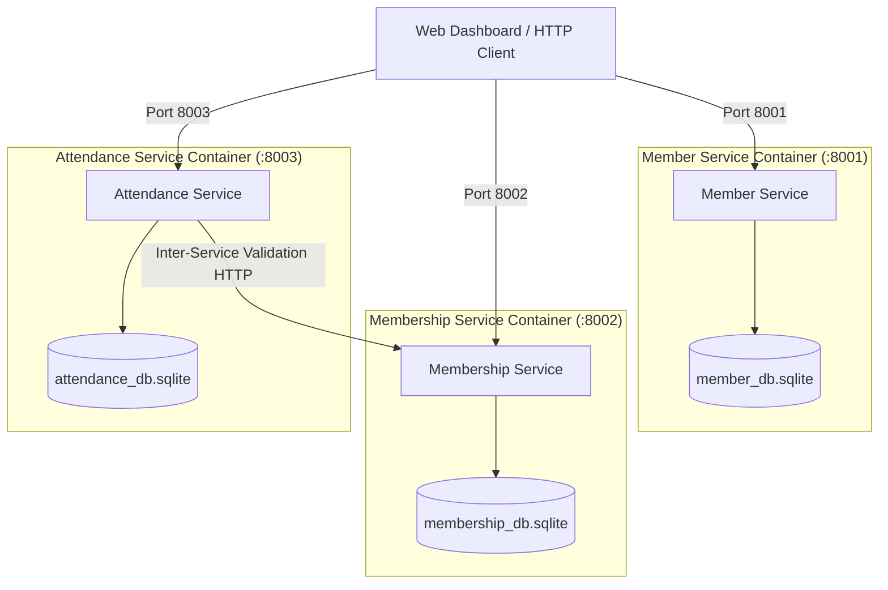

# Gym Management Microservices - Evaluation & Benchmark Lab

[](docker-compose.yml)
[](https://fastapi.tiangolo.com)
[](https://www.python.org/)
[](LICENSE)

An enterprise-grade, microservice-based **Gym Management System** built with **FastAPI**, **Docker**, **SQLite**, and custom **HTML5/Tailwind Web Dashboard**. Includes complete inter-service validation pipelines, zero-dependency test automation, workload benchmark analysis ($W_1$ to $W_5$), and technical evaluation documentation.

---

## 🏛️ System Architecture

The application is decomposed into 3 decoupled microservices operating on dedicated ports within a shared bridge network (`gym-network`):



### Microservice Specifications

| Microservice | Port | Database | Primary Responsibility |
| :--- | :--- | :--- | :--- |
| **Member Service** | `8001` | `member_db.sqlite` | Member profiles, registration, contact details, status management |
| **Membership Service** | `8002` | `membership_db.sqlite` | Membership plan tracking, activation, tier management, start/end dates |
| **Attendance Service** | `8003` | `attendance_db.sqlite` | Check-in gate verification, attendance logs, member attendance rate metrics |

---

## 🚀 Quick Start & Deployment

### Prerequisites
- [Docker](https://www.docker.com/) & Docker Compose
- Python 3.10+ (for local test runner & workload benchmarker)

### 1. Build and Launch Containers

Run the following command in the project root to start all 3 microservices in detached mode:

```bash
docker compose up --build -d
```

### 2. Verify Service Health

Check the status of running containers:

```bash
docker compose ps
```

All 3 services will be online:
- **Member Service**: `http://localhost:8001/docs`
- **Membership Service**: `http://localhost:8002/docs`
- **Attendance Service**: `http://localhost:8003/docs`

---

## 💻 Web Dashboard & CRUD Operations

Open `app_dashboard.html` in any web browser to access the **Enterprise Gym Management Dashboard**.

### Features:
- 👥 **Member Management**: Create, edit, view, and delete member records.
- 💳 **Membership Tracking**: Assign plans, update dates, toggle active/inactive status.
- ⏱️ **Live Access Control Gate**: Real-time check-in verification via member ID.
- 📊 **Analytics & Metrics**: Instant calculation of total members, active memberships, check-in totals, and average attendance rates.

---

## 🧪 Testing & Verification

Execute the zero-dependency end-to-end verification suite:

```bash
python3 run_tests.py
```

### Verification Checkpoints:
1. ✅ **Checkpoint 1**: Service Connectivity & OpenAPI Schema Integrity
2. ✅ **Checkpoint 2**: Member Lifecycle & Profile CRUD Operations
3. ✅ **Checkpoint 3**: Membership Subscription & Status Synchronization
4. ✅ **Checkpoint 4**: Inter-Service Gate Verification & Attendance Recording
5. ✅ **Checkpoint 5**: Metrics Aggregation & Analytical Reports

---

## 📈 Workload Concurrency Benchmarking

To run the full concurrency benchmark suite ($W_1 - W_5$) across increasing levels of concurrent requests ($N=1, 10, 50, 100, 200$):

```bash
python3 workload_test.py
```

### Benchmark Metric Charts

The benchmarking scripts evaluate system performance under dynamic load and generate visual performance charts:

| Response Time | Throughput |
| :---: | :---: |
|  |  |

| CPU Utilization | Memory Utilization |
| :---: | :---: |
|  |  |

---

## 📂 Project Repository Structure

```
GymManagementMicroservices/
├── docker-compose.yml              # Container orchestration for 3 services
├── app_dashboard.html              # Single-page web dashboard (CRUD & Gate)
├── run_tests.py                    # Automated test runner (5 Checkpoints)
├── workload_test.py                # Concurrency benchmark suite (W1 - W5)
├── generate_graphs.py              # Performance chart generation script
├── LAB_EVALUATION_REPORT.md        # Comprehensive technical report
├── member-service/                 # Member Microservice
│   ├── Dockerfile
│   ├── requirements.txt
│   └── app/
│       └── main.py
├── membership-service/             # Membership Microservice
│   ├── Dockerfile
│   ├── requirements.txt
│   └── app/
│       └── main.py
└── attendance-service/             # Attendance Microservice
    ├── Dockerfile
    ├── requirements.txt
    └── app/
        └── main.py
```

---

## 📄 Documentation & Evaluation Deliverables

- 📄 **[Technical Evaluation Report](LAB_EVALUATION_REPORT.md)**: Detailed evaluation report covering system design, API contracts, inter-service communication, and benchmark findings.
