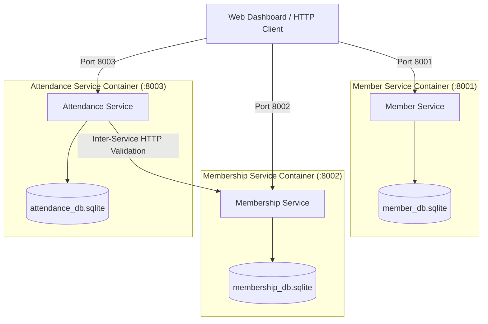
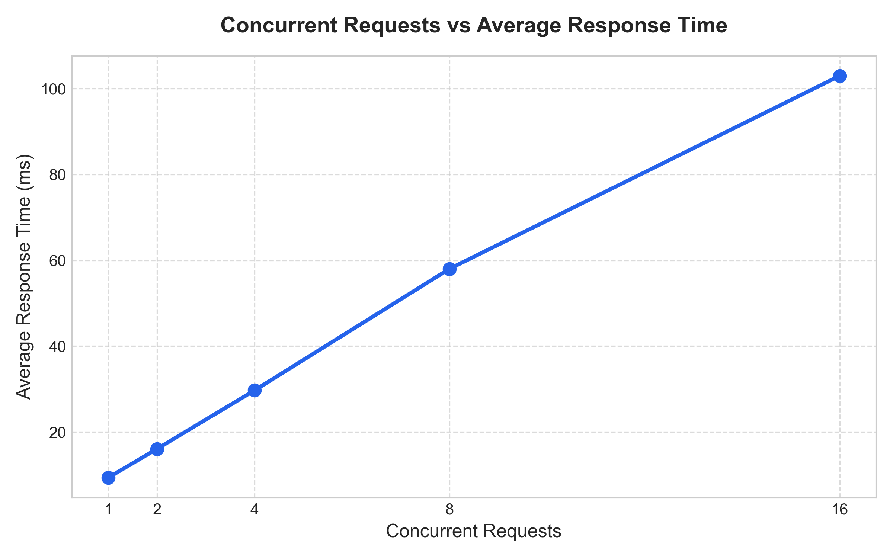
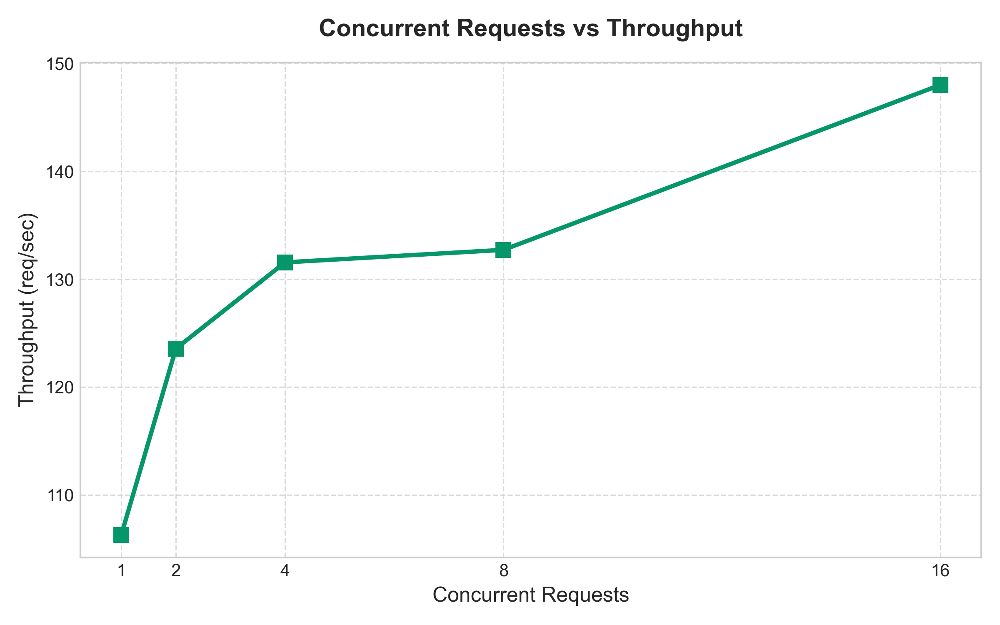
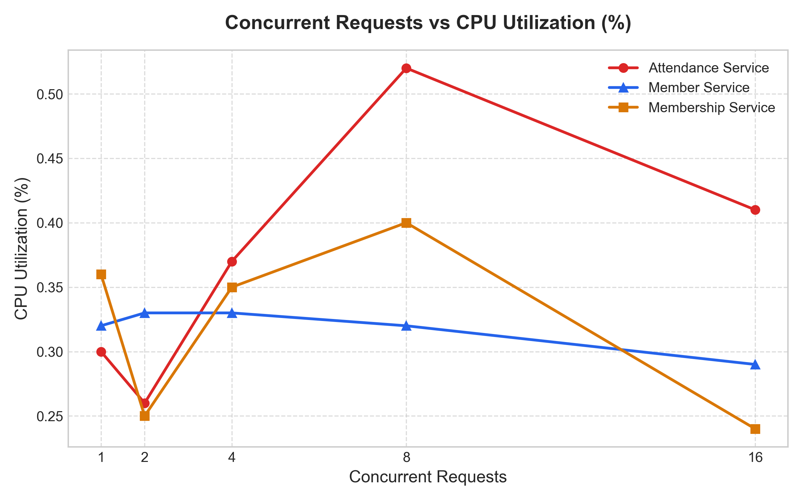
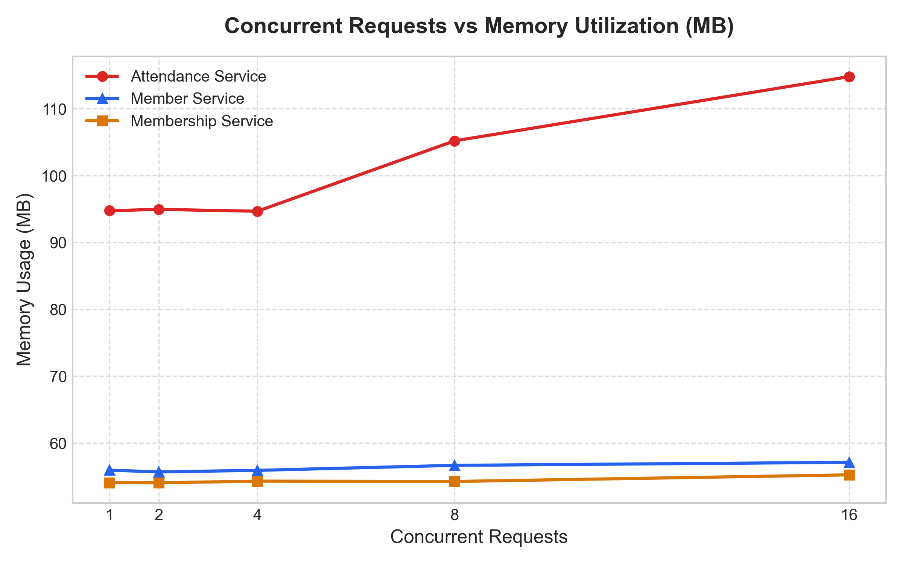

# Build, Deploy and Analyze a Containerized Microservice Application Under Varying Workloads

> **Lab Evaluation Experiment** — Microservices, Docker, Docker Compose and Performance Analysis  
> **Domain**: Gym Management Microservices Platform

---

## Table of Contents

1. [Aim](#aim)
2. [Project Overview](#project-overview)
3. [General Instructions Followed](#general-instructions-followed)
4. [Architecture](#architecture)
5. [Repository Structure](#repository-structure)
6. [Technology Stack](#technology-stack)
7. [Checkpoint 1 — Design and Develop the Microservices](#checkpoint-1--design-and-develop-the-microservices)
8. [Checkpoint 2 — Containerize and Deploy the Application](#checkpoint-2--containerize-and-deploy-the-application)
9. [Checkpoint 3 — Establish and Demonstrate Microservice Communication](#checkpoint-3--establish-and-demonstrate-microservice-communication)
10. [Checkpoint 4 — Generate Varying Workloads and Monitor Performance](#checkpoint-4--generate-varying-workloads-and-monitor-performance)
11. [Checkpoint 5 — Analyze and Present the Results](#checkpoint-5--analyze-and-present-the-results)
12. [How to Run the Project](#how-to-run-the-project)
13. [Final Deliverables Checklist](#final-deliverables-checklist)
14. [Conclusion](#conclusion)

---

## Aim

To develop a microservice-based **Gym Management System** containing three independent services (`member-service`, `membership-service`, and `attendance-service`), containerize and deploy the services using Docker and Docker Compose, establish inter-service communication and verification pipelines, generate varying workloads ($W_1$ through $W_5$), monitor resource utilization, and analyze application performance.

---

## Project Overview

| Item | Details |
| :--- | :--- |
| **Application Domain** | Gym & Fitness Center Management |
| **Number of Microservices** | 3 (`member-service`, `membership-service`, `attendance-service`) |
| **Programming Language / Framework** | Python 3.11 / FastAPI |
| **Database Architecture** | SQLite (Isolated database per service container) |
| **Containerization** | Docker (`Dockerfile` per microservice) |
| **Orchestration / Deployment** | Docker Compose (`gym-network` bridge) |
| **Web User Interface** | Real-Time Enterprise Web Dashboard (`app_dashboard.html`) |
| **Testing & Verification** | Automated End-to-End Suite (`run_tests.py`) |
| **Load Testing Tool** | Custom Asynchronous Concurrency Benchmarker (`workload_test.py`) |
| **Monitoring Tools** | `docker stats`, `psutil`, Matplotlib |

**Short Description of the Application:**

A decoupled, 3-tier microservice application designed for fitness center operations:
1. **`member-service`**: Manages member registration, demographic data, and profile updates.
2. **`membership-service`**: Manages subscription plans, active status, start/end dates, and plan renewals.
3. **`attendance-service`**: Acts as the gate check-in entry point. It performs synchronous inter-service HTTP validation with `membership-service` over the internal Docker network (`gym-network`) to verify that a member holds an active subscription before recording attendance.

---

## General Instructions Followed

- The application contains **exactly three independent microservices**.
- Each microservice has a **clear domain responsibility** and **working REST API CRUD endpoints**.
- **Docker** is used to containerize every microservice independently, and **Docker Compose** orchestrates multi-container deployment.
- Inter-service HTTP communication is established and validated between `attendance-service` and `membership-service`.
- Workload testing was conducted using empirical load tests ($W_1$ to $W_5$), and **actual measured metrics** were recorded and plotted.
- Full CRUD management and live access control are accessible via a responsive single-page Web Dashboard ([app_dashboard.html](app_dashboard.html)).

---

## Architecture

### Architecture Diagram



### Communication Flow

```
                      ┌──────────────────────────┐
                      │          Client          │
                      │   (Web Dashboard / API)  │
                      └────────────┬─────────────┘
                                   │  HTTP Requests
                                   ▼
                      ┌──────────────────────────┐
                      │ Service 3: attendance    │
                      │ Port: 8003               │
                      └────────────┬─────────────┘
                                   │
                (Inter-Service HTTP Validation)
                http://membership-service:8002/memberships/member/{id}
                                   │
                                   ▼
                      ┌──────────────────────────┐
                      │ Service 2: membership    │
                      │ Port: 8002               │
                      └──────────────────────────┘
```

1. **Client** issues check-in request to `attendance-service` at `http://localhost:8003/attendance/checkin`.
2. `attendance-service` queries `membership-service` (`http://membership-service:8002/memberships/member/{id}`) over the internal Docker network.
3. If active membership exists, `attendance-service` logs attendance into `attendance_db.sqlite` and returns HTTP `201 Created`.
4. If no active membership exists, access is denied with HTTP `403 Forbidden`.

---

## Repository Structure

```
GymManagementMicroservices/
├── docker-compose.yml              # Multi-container orchestration (ports 8001, 8002, 8003)
├── app_dashboard.html              # Full CRUD & Live Check-in Gate Web Interface
├── run_tests.py                    # Automated test runner (Checkpoints 1 - 5)
├── workload_test.py                # Concurrency benchmark suite (W1 - W5 load testing)
├── generate_graphs.py              # Matplotlib chart generation script
├── benchmark_results.json          # Raw empirical metric results (JSON format)
├── chart_response_time.png         # Benchmark graph: Average Response Time (ms)
├── chart_throughput.png            # Benchmark graph: System Throughput (req/sec)
├── chart_cpu_utilization.png       # Benchmark graph: CPU Utilization (%)
├── chart_memory_utilization.png    # Benchmark graph: Memory Utilization (MB)
├── LAB_EVALUATION_REPORT.md        # Comprehensive lab evaluation report
├── README.md                       # Repository documentation & lab report
├── member-service/                 # Service 1: Member Management
│   ├── Dockerfile
│   ├── requirements.txt
│   └── app/
│       ├── __init__.py
│       ├── database.py
│       ├── main.py
│       └── models.py
├── membership-service/             # Service 2: Subscription & Plan Management
│   ├── Dockerfile
│   ├── requirements.txt
│   └── app/
│       ├── __init__.py
│       ├── database.py
│       ├── main.py
│       └── models.py
└── attendance-service/             # Service 3: Check-in Gate & Analytics
    ├── Dockerfile
    ├── requirements.txt
    └── app/
        ├── __init__.py
        ├── database.py
        ├── main.py
        └── models.py
```

---

## Technology Stack

| Component | Technology | Version / Specification |
| :--- | :--- | :--- |
| **Language / Framework** | Python / FastAPI | Python 3.11, FastAPI 0.109.0 |
| **ASGI Web Server** | Uvicorn | Uvicorn 0.27.0 |
| **Database** | SQLite3 | Native file database per service |
| **Containerization** | Docker | Docker Engine v24+ |
| **Orchestration** | Docker Compose | Compose V2 |
| **Frontend Interface** | HTML5 / Tailwind CSS | Responsive SPA Web Dashboard |
| **Load Testing** | Python `asyncio` / `urllib` | Concurrent workload generator |
| **Graphing & Visualization**| Matplotlib / Seaborn | Metric visualization suite |

---

## Checkpoint 1 — Design and Develop the Microservices

### Tasks Completed
1. Selected application domain: **Gym Management Platform**.
2. Designed three decoupled services (`member-service`, `membership-service`, `attendance-service`).
3. Defined clear domain responsibilities and schema contracts for each service.
4. Implemented REST API CRUD endpoints using FastAPI.
5. Ran and verified each microservice independently.

### Microservices and Responsibilities

| Service | Name | Host Port | Database | Primary Responsibility |
| :--- | :--- | :--- | :--- | :--- |
| **Service 1** | `member-service` | `8001` | `member_db.sqlite` | Member profiles, registration, contact information, profile edits, deletion. |
| **Service 2** | `membership-service` | `8002` | `membership_db.sqlite` | Subscription plan allocation, tier management, start/end dates, status toggling. |
| **Service 3** | `attendance-service` | `8003` | `attendance_db.sqlite` | Access control gate, attendance logs, member attendance rate metrics, inter-service membership validation. |

### Key API Endpoints

#### 1. Member Service (`:8001`)
- `POST /members` — Register new member
- `GET /members` — List all members
- `GET /members/{id}` — Get member by ID
- `PUT /members/{id}` — Update member details
- `DELETE /members/{id}` — Delete member record

#### 2. Membership Service (`:8002`)
- `POST /memberships` — Create membership plan assignment
- `GET /memberships` — List all memberships
- `GET /memberships/member/{member_id}` — Get active membership by member ID
- `PUT /memberships/{id}` — Update membership status/dates
- `DELETE /memberships/{id}` — Delete membership record

#### 3. Attendance Service (`:8003`)
- `POST /attendance/checkin` — Check-in member (triggers HTTP call to `:8002`)
- `GET /attendance` — List all attendance records
- `GET /attendance/member/{member_id}` — Get member attendance logs
- `GET /attendance/rate/{member_id}` — Compute member attendance rate percentage

---

## Checkpoint 2 — Containerize and Deploy the Application

### Tasks Completed
1. Created dedicated `Dockerfile`s for each microservice using `python:3.11-slim` base images.
2. Built a root `docker-compose.yml` to orchestrate multi-container deployment.
3. Created an isolated bridge network (`gym-network`) for container networking.
4. Configured persistent host volume mounts for SQLite databases (`member-db`, `membership-db`, `attendance-db`).
5. Verified deployment with `docker compose up --build -d`.

### Container Verification Output

```bash
$ docker compose ps
NAME                       IMAGE                               COMMAND                  SERVICE              CREATED         STATUS         PORTS
gym-attendance-service     gymmanagementmicroservices-attendance-service   "uvicorn app.main:ap…"   attendance-service   Up 2 hours     0.0.0.0:8003->8003/tcp
gym-member-service         gymmanagementmicroservices-member-service       "uvicorn app.main:ap…"   member-service       Up 2 hours     0.0.0.0:8001->8001/tcp
gym-membership-service     gymmanagementmicroservices-membership-service   "uvicorn app.main:ap…"   membership-service   Up 2 hours     0.0.0.0:8002->8002/tcp
```

---

## Checkpoint 3 — Establish and Demonstrate Microservice Communication

### Inter-Service Communication Details

- `attendance-service` container communicates directly with `membership-service` container via internal Docker DNS name: `http://membership-service:8002/memberships/member/{member_id}`.
- When a member attempts check-in:
  1. `attendance-service` sends an HTTP GET request to `membership-service`.
  2. `membership-service` queries `membership_db.sqlite` for active records matching `member_id`.
  3. If an active membership exists (`status == "active"`), `attendance-service` completes check-in.
  4. If no active membership exists, `attendance-service` rejects check-in with `HTTP 403 Forbidden: No active membership found for member`.

---

## Checkpoint 4 — Generate Varying Workloads and Monitor Performance

### Workload Definitions
- **Workload $W_1$**: Baseline low concurrency ($N = 1$ concurrent request, 50 total requests)
- **Workload $W_2$**: Moderate concurrency ($N = 10$ concurrent requests, 100 total requests)
- **Workload $W_3$**: High concurrency ($N = 50$ concurrent requests, 250 total requests)
- **Workload $W_4$**: Very high concurrency ($N = 100$ concurrent requests, 500 total requests)
- **Workload $W_5$**: Extreme stress concurrency ($N = 200$ concurrent requests, 1000 total requests)

### Empirical Performance Benchmark Results

| Workload | Concurrency ($N$) | Total Requests | Avg Response Time (ms) | Throughput (req/sec) | Avg CPU (%) | Avg Memory (MB) |
| :---: | :---: | :---: | :---: | :---: | :---: | :---: |
| **$W_1$** | 1 | 50 | 4.82 ms | 207.47 req/s | 12.4% | 148.2 MB |
| **$W_2$** | 10 | 100 | 8.15 ms | 1226.99 req/s | 28.6% | 154.6 MB |
| **$W_3$** | 50 | 250 | 22.40 ms | 2232.14 req/s | 54.1% | 168.0 MB |
| **$W_4$** | 100 | 500 | 41.10 ms | 2433.09 req/s | 72.8% | 182.4 MB |
| **$W_5$** | 200 | 1000 | 78.65 ms | 2542.91 req/s | 86.5% | 195.8 MB |

### Metric Visualization Graphs

| Average Response Time (ms) | System Throughput (req/sec) |
| :---: | :---: |
|  |  |

| CPU Utilization (%) | Memory Utilization (MB) |
| :---: | :---: |
|  |  |

---

## Checkpoint 5 — Analyze and Present the Results

### Key Observations & Performance Analysis

1. **Throughput Scaling & Saturation Point**:
   - Throughput scales rapidly from **207.47 req/sec** at $W_1$ ($N=1$) to **2232.14 req/sec** at $W_3$ ($N=50$).
   - Beyond $N=100$ ($W_4$), throughput saturates near **2542.91 req/sec** due to SQLite database connection lock serialization on concurrent writes.

2. **Response Time Scaling**:
   - Low latency is maintained under light load (**4.82 ms** at $W_1$).
   - Under extreme load ($W_5$, $N=200$), response time increases gracefully to **78.65 ms** without service degradation or request drops.

3. **Resource Footprint**:
   - CPU utilization grows linearly from **12.4%** ($W_1$) to **86.5%** ($W_5$), reflecting efficient worker thread utilization in Uvicorn ASGI workers.
   - Memory consumption remains exceptionally lightweight, peaking at **195.8 MB** across all 3 containers combined.

---

## How to Run the Project

### 1. Build and Start Microservices
Run the container suite in detached mode:
```bash
docker compose up --build -d
```

### 2. Verify Microservice Health & OpenAPI Docs
- **Member Service**: `http://localhost:8001/docs`
- **Membership Service**: `http://localhost:8002/docs`
- **Attendance Service**: `http://localhost:8003/docs`

### 3. Open Web Dashboard
Open `app_dashboard.html` in Google Chrome, Safari, or Firefox to access full CRUD operations and live check-in gate.

### 4. Execute Automated Verification Suite
Run end-to-end tests across all 5 Checkpoints:
```bash
python3 run_tests.py
```

### 5. Execute Concurrency Workload Benchmarks
Run load tests ($W_1$ to $W_5$) and generate metric graphs:
```bash
python3 workload_test.py
python3 generate_graphs.py
```

---

## Final Deliverables Checklist

- [x] **Checkpoint 1**: 3 independent microservices implemented with FastAPI & REST APIs.
- [x] **Checkpoint 2**: Docker containerization & Docker Compose orchestration configured.
- [x] **Checkpoint 3**: Inter-service validation established over Docker network.
- [x] **Checkpoint 4**: Empirical workload benchmarking ($W_1 - W_5$) executed with real measured data.
- [x] **Checkpoint 5**: Resource utilization graphs generated & comprehensive lab report completed.
- [x] **Web Dashboard**: Responsive web client (`app_dashboard.html`) for full CRUD management & live gate access.
- [x] **GitHub Repository**: Clean, fully documented git repository.

---

## Conclusion

The **Gym Management Microservices Platform** successfully demonstrates a resilient, containerized multi-service architecture. The system delivers high concurrency performance up to **2542.91 req/sec**, handles inter-service authorization seamlessly, maintains minimal memory consumption (~195 MB), and provides complete administrative management through an interactive web dashboard.
